<div align="center">
  
</div>

# ECG-Explain

> A 12-lead ECG classifier that surfaces *why* it predicts what it predicts —
> per-lead Grad-CAM overlays highlighting the waveform regions driving each
> diagnosis. Built by a doctor who needed to trust the model before trusting
> the output.

<div align="center">

[](https://github.com/M-Omarjee/ecg-explain/actions/workflows/ci.yml)
[](https://www.python.org/downloads/)
[](LICENSE)

</div>

## Motivation

In hospital, no decision happens because of one number on a screen. Every
investigation has a *finding* attached — the chest X-ray report describes
which lobe the consolidation is in, the troponin trend is interpreted in the
context of the rise. Standalone numbers without their reasoning are clinically
useless and, worse, dangerous.

Most ECG classifiers are exactly this: a black box that emits a probability
and stops. **ECG-Explain** is built around the principle that an AI tool that
can't show its working has no place in clinical decision-making. Every
prediction is paired with a per-lead heatmap localising the waveform features
the model attended to. Whether the model is right or wrong, you can see *why*.

## Architecture

```mermaid
flowchart LR
    A[12-lead ECG<br/>10s @ 100Hz] --> B[Bandpass filter<br/>+ z-normalise]
    B --> C[1D ResNet<br/>~6M params]
    C --> D[Multi-label logits<br/>NORM/MI/STTC/CD/HYP]
    C --> E[Conv feature maps<br/>via feature_maps&#40;&#41;]
    E --> F[1D Grad-CAM]
    F --> G[Per-timepoint<br/>attribution]
    D --> H[Clinical 12-lead plot<br/>+ heatmap overlay]
    G --> H
```



## Highlights

- **1D ResNet** trained on PTB-XL (5 diagnostic superclasses)
- **1D Grad-CAM** producing per-lead attribution overlays
- **Clinical-style 6×2 lead layout** (the format cardiologists actually read)
- **Live demo** on Hugging Face Spaces — try it in your browser
- **Honest failure analysis** — case-study gallery includes the model's mistakes,
  not just its wins
- **Reproducible**: one config file, one command to retrain end-to-end

## Results

Trained on PTB-XL stratified folds 1–8, validated on fold 9, tested on fold 10.

| Class  | Test AUROC |
|--------|------------|
| NORM   | _TBD_      |
| MI     | _TBD_      |
| STTC   | _TBD_      |
| CD     | _TBD_      |
| HYP    | _TBD_      |
| **Macro** | **_TBD_** |

_Numbers will be filled in after the first headline training run. See
[`results/`](results/) for the full metrics JSON._

## Case studies

The model interpreting six representative test set ECGs. Heatmap intensity
indicates Grad-CAM attribution for the named class. _Captions reflect my
clinical reading alongside what the model attended to — to be finalised
once the model is trained._

### Correct: Normal sinus rhythm


> **Predicted:** NORM — _confidence to be filled in_
> **True label:** NORM
> **Attention falls on:** _to be described after training_
> **Clinical reading:** _to be added — expected attention to be diffuse,
> with no concentration on any pathological feature._

### Correct: Myocardial infarction


> **Predicted:** MI — _confidence to be filled in_
> **True label:** MI
> **Attention falls on:** _to be described — expected to localise on the ST
> segment in the inferior leads (II, III, aVF) for inferior MI, or anterior
> leads (V2-V4) for anterior MI._
> **Clinical reading:** _to be added._

### Correct: ST/T changes


> **Predicted:** STTC — _confidence to be filled in_
> **True label:** STTC
> **Attention falls on:** _to be described — expected to focus on the
> repolarisation phase (T-wave region)._
> **Clinical reading:** _to be added._

### Correct: Conduction disturbance


> **Predicted:** CD — _confidence to be filled in_
> **True label:** CD
> **Attention falls on:** _to be described — expected to focus on the QRS
> complex, particularly its duration and morphology._
> **Clinical reading:** _to be added._

### Correct: Hypertrophy


> **Predicted:** HYP — _confidence to be filled in_
> **True label:** HYP
> **Attention falls on:** _to be described — expected to focus on QRS
> amplitude in the precordial leads (V-leads), reflecting voltage criteria
> for hypertrophy._
> **Clinical reading:** _to be added._

### Failure: high-confidence wrong prediction


> **Predicted:** _to be filled in_
> **True label:** _to be filled in_
> **Attention falls on:** _to be described._
> **Why it failed:** _to be analysed — was attention on the right region
> but interpretation wrong, or was attention on a clinically irrelevant
> region?_
> **What this teaches us:** _to be added._

## Failure analysis

This section is the unfair advantage of having a doctor build the model. It's
also what would have to exist before any version of this could be used in
practice.

### Per-class reliability

_To be filled in after training._ Will report which classes are most and
least reliable, with per-class AUROC and F1 alongside qualitative comments.

| Class  | AUROC | F1 | Reliability notes |
|--------|-------|----|-------------------|
| NORM   | _TBD_ | _TBD_ | _e.g. "very reliable — when model says normal, it usually is"_ |
| MI     | _TBD_ | _TBD_ | _e.g. "good at obvious STEMI, struggles with subtle inferior changes"_ |
| STTC   | _TBD_ | _TBD_ | _to be added_ |
| CD     | _TBD_ | _TBD_ | _to be added_ |
| HYP    | _TBD_ | _TBD_ | _to be added_ |

### Attention concordance

For each class, does the model's Grad-CAM attention fall on the
*anatomically correct region* — the ST segment for MI, the QRS for CD, etc?

_To be quantified after training, by computing the fraction of total
attribution mass falling within the expected lead region per class._

### Subtype analysis

Within MI specifically:

- **Anterior vs inferior vs posterior** — _to be analysed; PTB-XL has
  enough subclass annotation to break this down._
- **Subtle vs overt presentations** — _to be analysed by stratifying on
  diagnostic likelihood (PTB-XL provides this)._

### How a clinician should and should not use this

**Appropriate uses:**

- Educational exploration of how a model interprets ECG morphology
- Hypothesis generation for what features matter for a diagnosis
- A second-look prompt to consider whether the model's flagged region
  warrants closer attention

**Inappropriate uses:**

- Sole or primary basis for clinical decisions
- Replacement for cardiologist review of any ECG
- Use on populations or equipment not represented in PTB-XL without
  re-validation
- Use in any acute or time-critical setting

## Installation

Requires Python 3.11+ and [`uv`](https://github.com/astral-sh/uv).

```bash
git clone https://github.com/M-Omarjee/ecg-explain.git
cd ecg-explain
uv sync --all-extras
```

## Reproducing

**1. Download PTB-XL** (~1 GB, ~30 min on a typical home connection):

```bash
uv run python scripts/download_data.py
```

**2. Smoke test the pipeline** (2 epochs of a small model, ~3 min on M2):

```bash
uv run python scripts/train.py configs/smoke.yaml
```

**3. Train the headline model**:

```bash
uv run python scripts/train.py configs/baseline.yaml
```

**4. Evaluate on the test set**:

```bash
uv run python scripts/evaluate.py \
    --config configs/baseline.yaml \
    --checkpoint checkpoints/baseline/best.pt \
    --output results/baseline_test_metrics.json
```

**5. Generate case studies for the README**:

```bash
uv run python scripts/build_case_studies.py \
    --config configs/baseline.yaml \
    --checkpoint checkpoints/baseline/best.pt
```

**6. Run the demo locally**:

```bash
uv run python app/app.py
# Open http://127.0.0.1:7860
```

## Project structure

```
ecg-explain/
├── src/ecg_explain/
│   ├── data/         # PTB-XL loading, label mapping, preprocessing
│   ├── models/       # 1D ResNet (with Grad-CAM-ready feature_maps())
│   ├── training/     # Loss, metrics, trainer with MPS support
│   ├── interpret/    # 1D Grad-CAM
│   └── viz/          # Clinical 6×2 ECG plotting + heatmap overlay
├── app/              # Gradio demo
├── configs/          # YAML configs (smoke, baseline)
├── scripts/          # CLI entry points
├── tests/            # ~50 tests, no real data required for most
└── .github/workflows/  # CI: lint + test on every push
```

## Model card

See [MODEL_CARD.md](MODEL_CARD.md) for the model's intended use, training
details, evaluation, known failure modes, and ethical considerations.

## Dataset citation

PTB-XL is the property of its authors. If you use this code or the trained
model, please cite:

> Wagner, P., Strodthoff, N., Bousseljot, R.-D., Kreiseler, D., Lunze, F.I.,
> Samek, W., Schaeffter, T. (2020). PTB-XL: A Large Publicly Available
> Electrocardiography Dataset. *Scientific Data*. https://doi.org/10.1038/s41597-020-0495-6

## License

MIT. See [LICENSE](LICENSE).

<br>

<div align="center">

Built by [Muhammed Omarjee](https://github.com/M-Omarjee), Resident Doctor (MBBS, King's College London).

*Interested in AI tooling that supports clinical reasoning rather than replacing it.*

</div>
