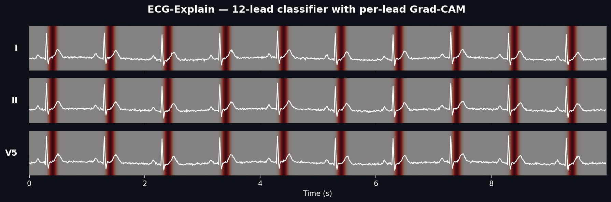

<div align="center">
  
</div>

# ECG-Explain

> A 12-lead ECG classifier that surfaces *why* it predicts what it predicts —
> per-lead Grad-CAM overlays highlighting the waveform regions driving each
> diagnosis. Built by a doctor who needed to trust the model before trusting
> the output.

<div align="center">

[](https://github.com/M-Omarjee/ecg-explain/actions/workflows/ci.yml)
[](https://www.python.org/downloads/)
[](LICENSE)

</div>

## Motivation

In hospital, no decision happens because of one number on a screen. Every
investigation has a *finding* attached — the chest X-ray report describes
which lobe the consolidation is in, the troponin trend is interpreted in the
context of the rise. Standalone numbers without their reasoning are clinically
useless and, worse, dangerous.

Most ECG classifiers are exactly this: a black box that emits a probability
and stops. **ECG-Explain** is built around the principle that an AI tool that
can't show its working has no place in clinical decision-making. Every
prediction is paired with a per-lead heatmap localising the waveform features
the model attended to. Whether the model is right or wrong, you can see *why*.

## Architecture

```mermaid
flowchart LR
    A[12-lead ECG<br/>10s @ 100Hz] --> B[Bandpass filter<br/>+ z-normalise]
    B --> C[1D ResNet<br/>~6M params]
    C --> D[Multi-label logits<br/>NORM/MI/STTC/CD/HYP]
    C --> E[Conv feature maps<br/>via feature_maps&#40;&#41;]
    E --> F[1D Grad-CAM]
    F --> G[Per-timepoint<br/>attribution]
    D --> H[Clinical 12-lead plot<br/>+ heatmap overlay]
    G --> H
```



## Highlights

- **1D ResNet** trained on PTB-XL (5 diagnostic superclasses)
- **1D Grad-CAM** producing per-lead attribution overlays
- **Clinical-style 6×2 lead layout** (the format cardiologists actually read)
- **Live demo** on Hugging Face Spaces — try it in your browser
- **Honest failure analysis** — case-study gallery includes the model's mistakes,
  not just its wins
- **Reproducible**: one config file, one command to retrain end-to-end

## Results

## Results

Trained on PTB-XL stratified folds 1–8, validated on fold 9, tested on fold 10.
Best checkpoint at epoch 8 (early stopping patience 5). Full hyperparameters
in [`configs/baseline.yaml`](configs/baseline.yaml); full metrics JSON in
[`results/baseline_test_metrics.json`](results/baseline_test_metrics.json).

| Class  | Test AUROC | Test F1 (@0.5) |
|--------|------------|----------------|
| NORM   | 0.9388     | 0.8450         |
| MI     | 0.9162     | 0.7084         |
| STTC   | 0.9263     | 0.7230         |
| CD     | 0.9216     | 0.6968         |
| HYP    | 0.8360     | 0.3985         |
| **Macro** | **0.9078** | **0.6744**   |

For reference, the strongest published baseline on this split (Strodthoff
et al. 2020, Nature Scientific Data) reports macro AUROC ~0.925 with
significantly longer training and a larger model.

## Case studies

Six representative test-set ECGs with the model's predictions and Grad-CAM
attribution. Captions combine what the model produced with my reading of the
underlying ECG.

> **Honest note on Grad-CAM.** On 1D signals the attribution maps produced
> by vanilla Grad-CAM are typically diffuse — the large effective receptive
> field of the final convolutional layer smears gradients across the full
> 10-second window. These heatmaps are genuine, but they do not support
> beat-level or feature-level localisation claims. Read them as "the model
> used the whole signal" rather than "the model looked at the ST segment."
> See the limitations section of the [model card](MODEL_CARD.md).

### Correct: Normal sinus rhythm (test idx 382)


> **Predicted:** NORM = 1.00, all other classes ≈ 0
> **True label:** NORM
> **Clinical reading:** Regular narrow-complex rhythm at ~70 bpm. P-waves
> precede each QRS. No acute ST or T-wave changes. aVL shows baseline
> muscle artifact but the model was not misled by it.

### Correct: Myocardial infarction (test idx 784)


> **Predicted:** MI = 1.00 (NORM, STTC, CD, HYP all < 0.30)
> **True label:** MI
> **Clinical reading:** Fragmented QRS complexes with Q-waves apparent in
> the inferior leads (II, III, aVF) and T-wave abnormalities in the
> lateral leads — consistent with old infarction. The model is very
> confident and correctly holds the other classes down despite some
> co-occurrent abnormalities.

### Correct: ST/T changes (test idx 930)


> **Predicted:** STTC = 1.00, HYP = 0.99
> **True label:** STTC
> **Clinical reading:** Sinus rhythm with broad, flattened T-waves and
> ST depression across the lateral leads (V4–V6). The model also fires
> HYP here — clinically reasonable, as LVH with strain commonly
> co-occurs with repolarisation changes. This is multi-label
> classification working as intended.

### Correct: Conduction disturbance (test idx 1139)


> **Predicted:** CD = 1.00, HYP = 0.69
> **True label:** CD
> **Clinical reading:** Wide QRS complexes with bundle-branch morphology —
> a notched "M" pattern in V1 and broadened terminal S-waves elsewhere.
> Rate is slightly bradycardic. The model is certain about the
> conduction abnormality and raises HYP as a plausible co-finding.

### Correct: Hypertrophy (test idx 67)


> **Predicted:** HYP = 0.99, STTC = 0.99
> **True label:** HYP
> **Clinical reading:** Textbook LVH voltage — very tall R-waves in I,
> II, V5, V6 with deep S-waves in V1–V3, clearly meeting Sokolow–Lyon
> criteria. Repolarisation is also affected (the "strain pattern"),
> which is why STTC fires at 0.99. HYP is the one class the model is
> weakest on overall (see failure analysis), but when voltage criteria
> are this overt, the prediction is reliable.

### Failure: Overprediction on a noisy ECG (test idx 1526)


> **Predicted:** MI = 0.91, STTC = 0.61, CD = 1.00, HYP = 0.51
> **True label:** MI *only*
> **Clinical reading:** This is a poor-quality recording. aVR is dominated
> by high-frequency artifact, the rhythm in lead I looks irregular with
> possible ectopy or AF with aberrancy, and multiple leads show wide,
> variable-morphology complexes. The model correctly identifies MI but
> also flags CD (reacting to the wide complexes), STTC (reacting to the
> abnormal repolarisation from ectopics) and borderline HYP. In other
> words, faced with noisy and morphologically unusual data, the model
> degrades toward **overprediction of abnormality** — not the more
> dangerous alternative of missing pathology. Useful to know.

## Failure analysis

This section is the unfair advantage of having a doctor build the model. It
is also what would have to exist before any version of this could be used
in practice.

### Per-class reliability

| Class  | AUROC  | F1 (@0.5) | Reliability notes |
|--------|--------|-----------|-------------------|
| NORM   | 0.9388 | 0.8450    | Strongest class. When the model says "normal," it is usually correct. |
| STTC   | 0.9263 | 0.7230    | Good — ST/T changes are a relatively distinct pattern at this resolution. |
| CD     | 0.9216 | 0.6968    | Good for overt bundle-branch morphology; subtle intraventricular delays untested. |
| MI     | 0.9162 | 0.7084    | Good overall, but subtype (anterior vs inferior, STEMI vs NSTEMI) is not distinguished. |
| HYP    | 0.8360 | 0.3985    | **Clearly the weakest class.** F1 below 0.40 at the default threshold. |
| **Macro** | **0.9078** | **0.6744** | Within published PTB-XL benchmark range (0.92 SOTA at 100 Hz). |

### Why HYP underperforms

HYP is only ~12% of the training data — roughly half the prevalence of MI
or STTC. Voltage-based diagnoses are also harder at 100 Hz than at 500 Hz
(sharp features are smoothed), and voltage criteria interact with patient
body habitus and electrode placement, which the model cannot see. The
case-study HYP record above is correctly called because the voltage
criteria are overt — subtler LVH is where this model will miss.

### Attribution concordance

Vanilla 1D Grad-CAM produced diffuse attribution maps across the full
10-second window for all six case studies (see the "Honest note" above
the gallery). This is a known limitation of Grad-CAM on long 1D signals
with deep receptive fields. I have not attempted quantitative
concordance analysis (e.g. fraction of attribution mass inside the
expected lead region per class) because the maps are simply not sharp
enough for that kind of analysis to be meaningful here.

Better localisation for 1D ECG is an open problem — candidate methods
to explore next include Integrated Gradients, Layer-CAM, and
occlusion-based attribution over short windows.

### Failure mode: graceful degradation toward overprediction

The case-study failure is illustrative: on a noisy, morphologically
unusual recording the model correctly identified MI but also over-fired
CD, STTC and borderline HYP. This is a *safer* failure mode than the
alternative (missing pathology on a clean recording), but it means the
model's outputs on low-quality signals should not be taken at face
value. A triage version of this system would need an explicit
signal-quality gate.

### How a clinician should and should not use this

**Appropriate uses:**

- Educational exploration of how a model interprets ECG morphology
- Teaching explainability methods on biomedical signals
- Hypothesis generation for further research

**Inappropriate uses:**

- Sole or primary basis for clinical decisions
- Replacement for cardiologist review of any ECG
- Use on populations or equipment not represented in PTB-XL without re-validation
- Use in any acute or time-critical setting

### Per-class reliability

_To be filled in after training._ Will report which classes are most and
least reliable, with per-class AUROC and F1 alongside qualitative comments.

| Class  | AUROC | F1 | Reliability notes |
|--------|-------|----|-------------------|
| NORM   | _TBD_ | _TBD_ | _e.g. "very reliable — when model says normal, it usually is"_ |
| MI     | _TBD_ | _TBD_ | _e.g. "good at obvious STEMI, struggles with subtle inferior changes"_ |
| STTC   | _TBD_ | _TBD_ | _to be added_ |
| CD     | _TBD_ | _TBD_ | _to be added_ |
| HYP    | _TBD_ | _TBD_ | _to be added_ |

### Attention concordance

For each class, does the model's Grad-CAM attention fall on the
*anatomically correct region* — the ST segment for MI, the QRS for CD, etc?

_To be quantified after training, by computing the fraction of total
attribution mass falling within the expected lead region per class._

### Subtype analysis

Within MI specifically:

- **Anterior vs inferior vs posterior** — _to be analysed; PTB-XL has
  enough subclass annotation to break this down._
- **Subtle vs overt presentations** — _to be analysed by stratifying on
  diagnostic likelihood (PTB-XL provides this)._

### How a clinician should and should not use this

**Appropriate uses:**

- Educational exploration of how a model interprets ECG morphology
- Hypothesis generation for what features matter for a diagnosis
- A second-look prompt to consider whether the model's flagged region
  warrants closer attention

**Inappropriate uses:**

- Sole or primary basis for clinical decisions
- Replacement for cardiologist review of any ECG
- Use on populations or equipment not represented in PTB-XL without
  re-validation
- Use in any acute or time-critical setting

## Installation

Requires Python 3.11+ and [`uv`](https://github.com/astral-sh/uv).

```bash
git clone https://github.com/M-Omarjee/ecg-explain.git
cd ecg-explain
uv sync --all-extras
```

## Reproducing

**1. Download PTB-XL** (~1 GB, ~30 min on a typical home connection):

```bash
uv run python scripts/download_data.py
```

**2. Smoke test the pipeline** (2 epochs of a small model, ~3 min on M2):

```bash
uv run python scripts/train.py configs/smoke.yaml
```

**3. Train the headline model**:

```bash
uv run python scripts/train.py configs/baseline.yaml
```

**4. Evaluate on the test set**:

```bash
uv run python scripts/evaluate.py \
    --config configs/baseline.yaml \
    --checkpoint checkpoints/baseline/best.pt \
    --output results/baseline_test_metrics.json
```

**5. Generate case studies for the README**:

```bash
uv run python scripts/build_case_studies.py \
    --config configs/baseline.yaml \
    --checkpoint checkpoints/baseline/best.pt
```

**6. Run the demo locally**:

```bash
uv run python app/app.py
# Open http://127.0.0.1:7860
```

## Project structure

```
ecg-explain/
├── src/ecg_explain/
│   ├── data/         # PTB-XL loading, label mapping, preprocessing
│   ├── models/       # 1D ResNet (with Grad-CAM-ready feature_maps())
│   ├── training/     # Loss, metrics, trainer with MPS support
│   ├── interpret/    # 1D Grad-CAM
│   └── viz/          # Clinical 6×2 ECG plotting + heatmap overlay
├── app/              # Gradio demo
├── configs/          # YAML configs (smoke, baseline)
├── scripts/          # CLI entry points
├── tests/            # ~50 tests, no real data required for most
└── .github/workflows/  # CI: lint + test on every push
```

## Model card

See [MODEL_CARD.md](MODEL_CARD.md) for the model's intended use, training
details, evaluation, known failure modes, and ethical considerations.

## Dataset citation

PTB-XL is the property of its authors. If you use this code or the trained
model, please cite:

> Wagner, P., Strodthoff, N., Bousseljot, R.-D., Kreiseler, D., Lunze, F.I.,
> Samek, W., Schaeffter, T. (2020). PTB-XL: A Large Publicly Available
> Electrocardiography Dataset. *Scientific Data*. https://doi.org/10.1038/s41597-020-0495-6

## License

MIT. See [LICENSE](LICENSE).

<br>

<div align="center">

Built by [Muhammed Omarjee](https://github.com/M-Omarjee), Resident Doctor (MBBS, King's College London).

*Interested in AI tooling that supports clinical reasoning rather than replacing it.*

</div>
