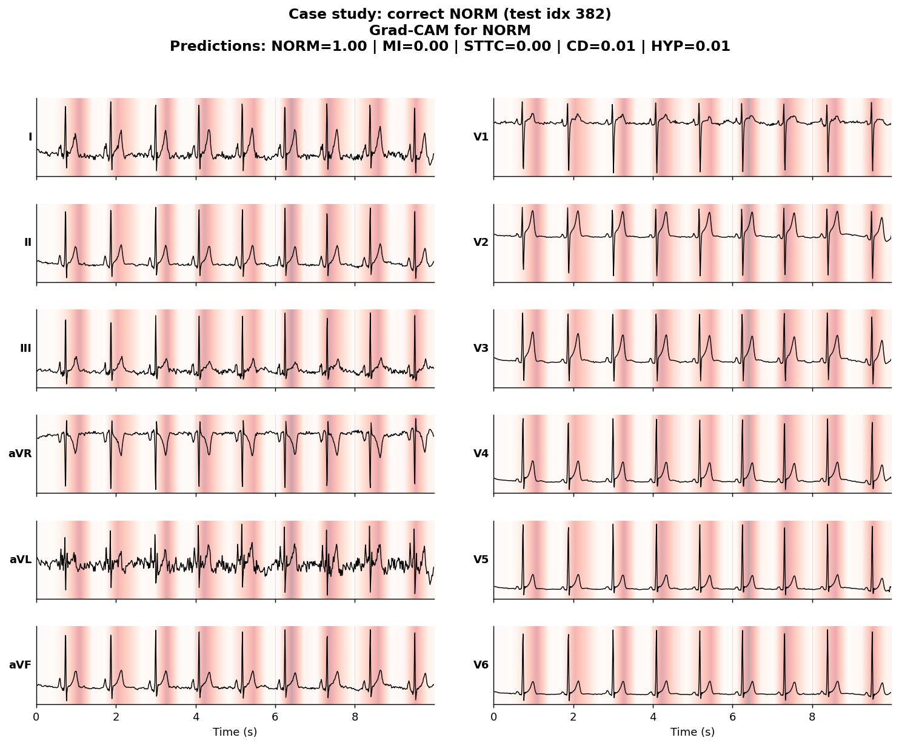
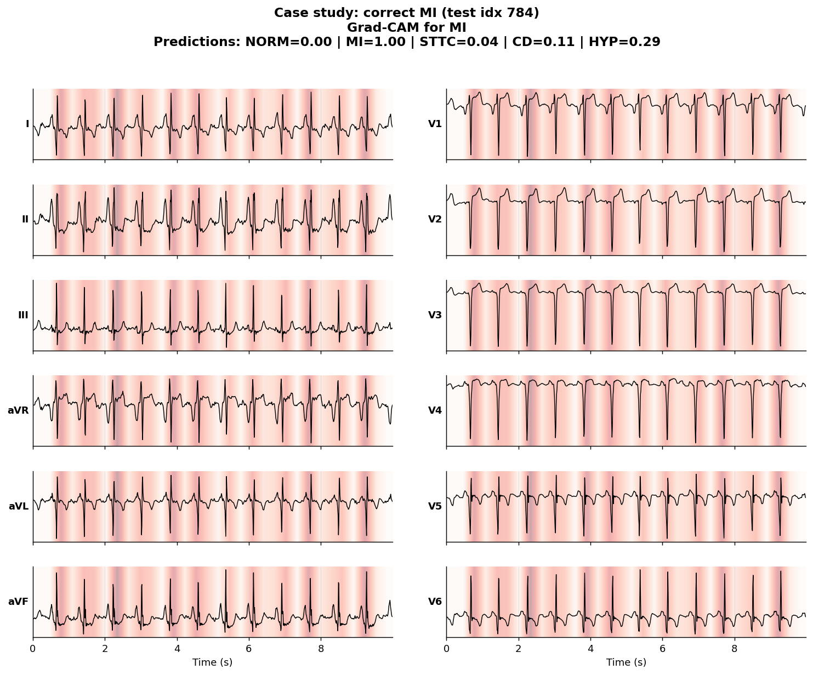
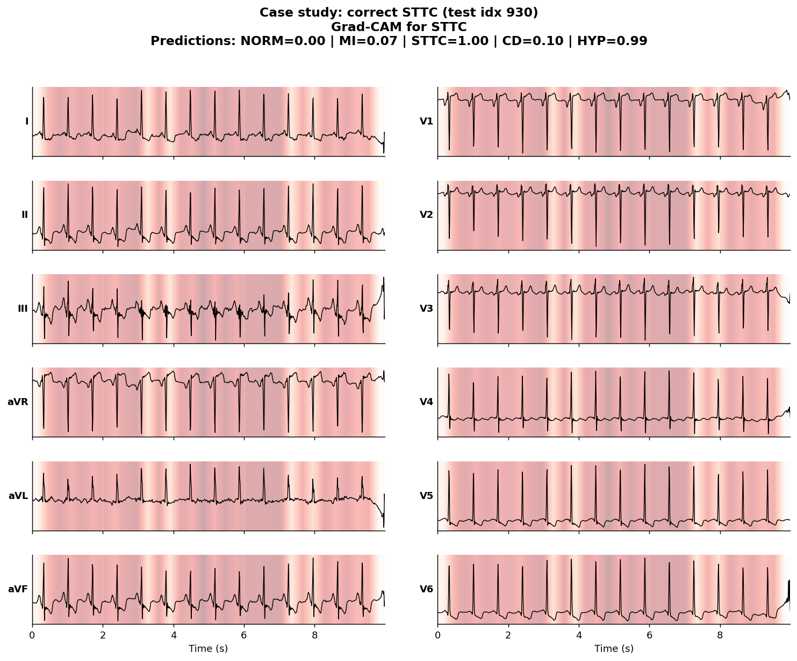
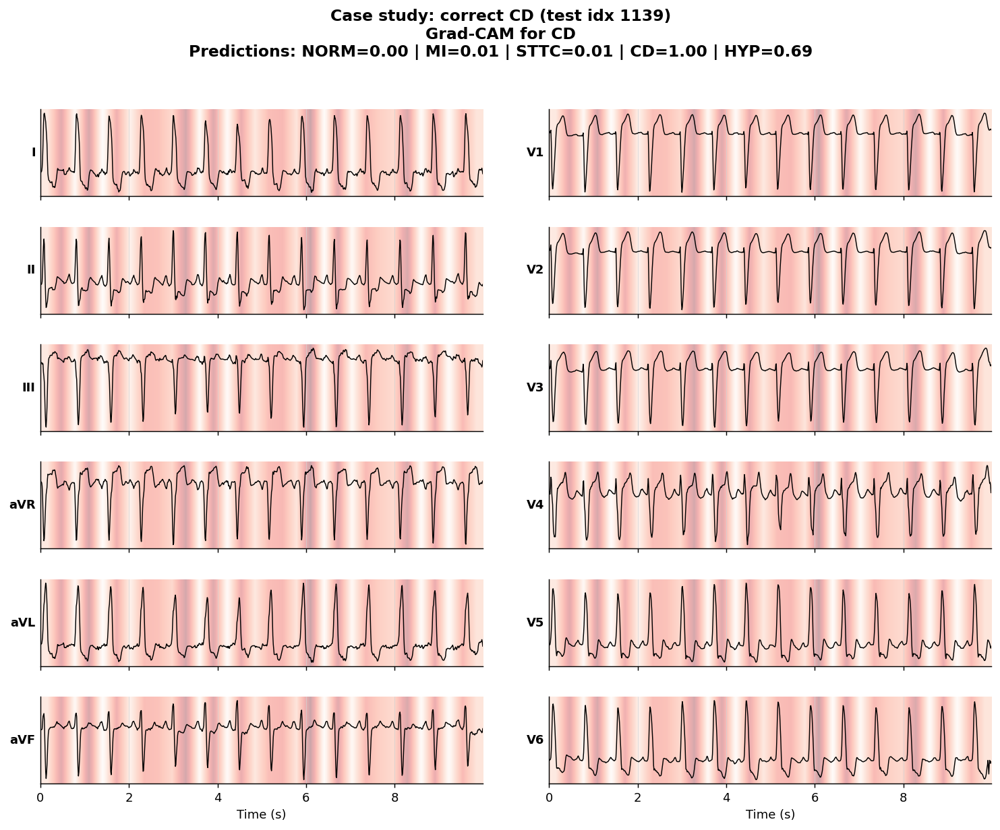
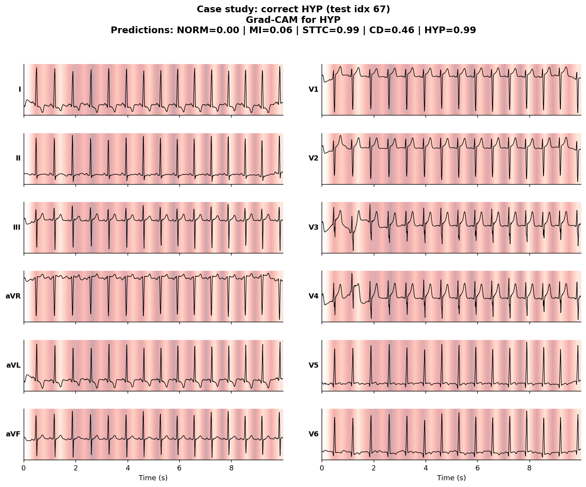
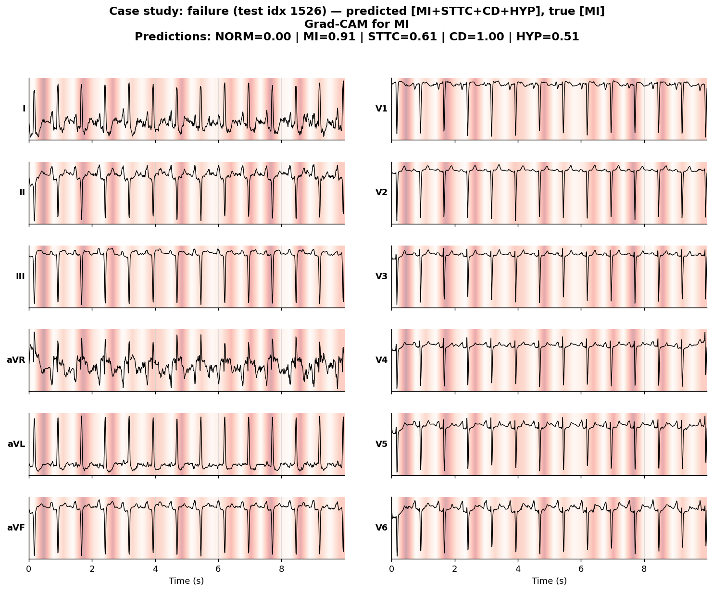

# ECG-Explain

> A 12-lead ECG classifier that surfaces *why* it predicts what it predicts —
> per-lead Grad-CAM overlays highlighting the waveform regions driving each
> diagnosis. Built by a doctor who needed to trust the model before trusting
> the output.

[](https://github.com/M-Omarjee/ecg-explain/actions/workflows/ci.yml)
[](https://www.python.org/downloads/)
[](LICENSE)

## Motivation

In hospital, no decision happens because of one number on a screen. Every
investigation has a *finding* attached — the chest X-ray report describes
which lobe the consolidation is in, the troponin trend is interpreted in the
context of the rise. Standalone numbers without their reasoning are clinically
useless and, worse, dangerous.

Most ECG classifiers are exactly this: a black box that emits a probability
and stops. **ECG-Explain** is built around the principle that an AI tool that
can't show its working has no place in clinical decision-making. Every
prediction is paired with a per-lead heatmap localising the waveform features
the model attended to. Whether the model is right or wrong, you can see *why*.

## Highlights

- **1D ResNet** trained on PTB-XL (5 diagnostic superclasses)
- **1D Grad-CAM** producing per-lead attribution overlays
- **Clinical-style 6×2 lead layout** (the format cardiologists actually read)
- **Live demo** on Hugging Face Spaces — try it in your browser
- **Honest failure analysis** — case-study gallery includes the model's mistakes,
  not just its wins
- **Reproducible**: one config file, one command to retrain end-to-end

## Results

Trained on PTB-XL stratified folds 1–8, validated on fold 9, tested on fold 10.

| Class  | Test AUROC |
|--------|------------|
| NORM   | _TBD_      |
| MI     | _TBD_      |
| STTC   | _TBD_      |
| CD     | _TBD_      |
| HYP    | _TBD_      |
| **Macro** | **_TBD_** |

_Numbers will be filled in after the first headline training run. See
[`results/`](results/) for the full metrics JSON._

## Case studies

The model interpreting six representative test set ECGs. Heatmap intensity
indicates Grad-CAM attribution for the named class.

| | |
|---|---|
|  |  |
| _Normal sinus rhythm — model attends evenly across the cardiac cycle._ | _Inferior MI — model focuses on ST segments in II/III/aVF._ |
|  |  |
| _ST/T changes — attention concentrated on the T-wave region._ | _Conduction disturbance — attention on the QRS complex._ |
|  |  |
| _LV hypertrophy — attention on QRS amplitude in V-leads._ | _High-confidence failure — discussed in the failure analysis below._ |

> Captions will be expanded with my own clinical reading after the first
> training run, including discussion of where attention does and doesn't
> match the expected anatomical region for each class.

## Failure analysis

_To be written after the first training run. Will include:_

- Which classes the model is least reliable on
- Whether attention falls on clinically appropriate regions even when the
  classification is wrong
- Specific MI subtypes the model struggles with (anterior vs inferior vs
  posterior, subtle vs overt)
- Recommendations for how a clinician should and shouldn't use the output

This section is the unfair advantage of having a doctor build the model. It's
also what would have to exist before any version of this could be used in
practice.

## Installation

Requires Python 3.11+ and [`uv`](https://github.com/astral-sh/uv).

```bash
git clone https://github.com/M-Omarjee/ecg-explain.git
cd ecg-explain
uv sync --all-extras
```

## Reproducing

**1. Download PTB-XL** (~1 GB, ~30 min on a typical home connection):

```bash
uv run python scripts/download_data.py
```

**2. Smoke test the pipeline** (2 epochs of a small model, ~3 min on M2):

```bash
uv run python scripts/train.py configs/smoke.yaml
```

**3. Train the headline model**:

```bash
uv run python scripts/train.py configs/baseline.yaml
```

**4. Evaluate on the test set**:

```bash
uv run python scripts/evaluate.py \
    --config configs/baseline.yaml \
    --checkpoint checkpoints/baseline/best.pt \
    --output results/baseline_test_metrics.json
```

**5. Generate case studies for the README**:

```bash
uv run python scripts/build_case_studies.py \
    --config configs/baseline.yaml \
    --checkpoint checkpoints/baseline/best.pt
```

**6. Run the demo locally**:

```bash
uv run python app/app.py
# Open http://127.0.0.1:7860
```

## Project structure

ecg-explain/
├── src/ecg_explain/
│   ├── data/         # PTB-XL loading, label mapping, preprocessing
│   ├── models/       # 1D ResNet (with Grad-CAM-ready feature_maps())
│   ├── training/     # Loss, metrics, trainer with MPS support
│   ├── interpret/    # 1D Grad-CAM
│   └── viz/          # Clinical 6×2 ECG plotting + heatmap overlay
├── app/              # Gradio demo
├── configs/          # YAML configs (smoke, baseline)
├── scripts/          # CLI entry points
├── tests/            # ~50 tests, no real data required for most
└── .github/workflows/  # CI: lint + test on every push

## Model card

See [MODEL_CARD.md](MODEL_CARD.md) for the model's intended use, training
details, evaluation, known failure modes, and ethical considerations.

## Dataset citation

PTB-XL is the property of its authors. If you use this code or the trained
model, please cite:

> Wagner, P., Strodthoff, N., Bousseljot, R.-D., Kreiseler, D., Lunze, F.I.,
> Samek, W., Schaeffter, T. (2020). PTB-XL: A Large Publicly Available
> Electrocardiography Dataset. *Scientific Data*. https://doi.org/10.1038/s41597-020-0495-6

## License

MIT. See [LICENSE](LICENSE).

## About the author

Built by [Muhammed Omarjee](https://github.com/M-Omarjee), Resident Doctor
(MBBS, King's College London). Interested in AI tooling that supports clinical
reasoning rather than replacing it.